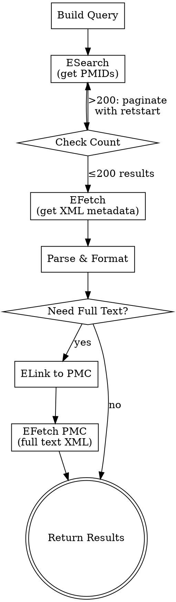

# PubMed Literature Retrieval

## Overview

Search and retrieve biomedical literature from PubMed using NCBI E-utilities REST API. Zero local dependencies — all calls are HTTP GET/POST to `eutils.ncbi.nlm.nih.gov`. Designed for cloud deployment and LLM tool integration.

## When to Use

- Writing papers, grant proposals, or literature reviews that need citation support
- Searching PubMed by keywords, authors, date ranges, MeSH terms, or publication types
- Retrieving structured metadata (title, authors, abstract, DOI, etc.) for a set of articles
- Attempting to fetch full-text articles from PubMed Central (PMC)
- Building reference lists from search results

## Base URL

All E-utility requests use:

```
https://eutils.ncbi.nlm.nih.gov/entrez/eutils/
```

## API Key & Rate Limits

| Config | Rate Limit | Notes |
|--------|-----------|-------|
| No API key | 3 requests/sec | Default, sufficient for small searches |
| With API key | 10 requests/sec | Get key from https://www.ncbi.nlm.nih.gov/account/settings/ |

Include API key in every request: `&api_key=YOUR_KEY`

Always include `&tool=your_tool_name&email=your@email.com` in requests for NCBI compliance.

## Core Workflow



## Step 1: ESearch — Search PubMed

### URL Pattern

```
https://eutils.ncbi.nlm.nih.gov/entrez/eutils/esearch.fcgi?db=pubmed&term=<QUERY>&retmax=<N>&retstart=<OFFSET>&usehistory=y&sort=relevance
```

### Query Syntax — Field Tags

| Field Tag | Meaning | Example |
|-----------|---------|---------|
| `[tiab]` | Title/Abstract | `cancer[tiab]` |
| `[ti]` | Title only | `CRISPR[ti]` |
| `[au]` | Author | `Zhang Y[au]` |
| `[1au]` | First author | `Smith J[1au]` |
| `[lastau]` | Last author | `Wang L[lastau]` |
| `[ta]` | Journal abbreviation | `Nature[ta]` |
| `[dp]` | Date of publication | `2023[dp]` or `2020:2024[dp]` |
| `[pt]` | Publication type | `Review[pt]` |
| `[mh]` | MeSH heading | `Neoplasms[mh]` |
| `[majr]` | MeSH major topic | `Breast Neoplasms[majr]` |
| `[sh]` | MeSH subheading | `therapy[sh]` |
| `[la]` | Language | `English[la]` |
| `[sb]` | Subset | `free full text[sb]` |
| `[filter]` | Filter | `humans[filter]` |

### Boolean Operators

Use uppercase: `AND`, `OR`, `NOT`

```
(breast cancer[tiab] OR breast neoplasms[mh]) AND immunotherapy[tiab] AND 2020:2024[dp] AND Review[pt]
```

### Publication Type Filters

| Type | Tag |
|------|-----|
| Review | `Review[pt]` |
| Systematic Review | `Systematic Review[pt]` |
| Meta-Analysis | `Meta-Analysis[pt]` |
| Clinical Trial | `Clinical Trial[pt]` |
| Randomized Controlled Trial | `Randomized Controlled Trial[pt]` |
| Case Reports | `Case Reports[pt]` |
| Editorial | `Editorial[pt]` |
| Letter | `Letter[pt]` |

### Sort Options

| Value | Meaning |
|-------|---------|
| `relevance` | Best match (default) |
| `pub_date` | Most recent first |
| `Author` | By first author |
| `JournalName` | By journal |

### ESearch Parameters

| Parameter | Required | Description |
|-----------|----------|-------------|
| `db` | Yes | Always `pubmed` |
| `term` | Yes | Search query with field tags |
| `retmax` | No | Max UIDs returned (default 20, max 10000) |
| `retstart` | No | Index offset for pagination (default 0) |
| `usehistory` | No | Set `y` to store results on History Server |
| `sort` | No | Sort order (see above) |
| `datetype` | No | `pdat` (pub date), `edat` (Entrez date) |
| `mindate` | No | Start date (YYYY/MM/DD or YYYY) |
| `maxdate` | No | End date (YYYY/MM/DD or YYYY) |
| `api_key` | No | NCBI API key |

### Example ESearch Call

```
https://eutils.ncbi.nlm.nih.gov/entrez/eutils/esearch.fcgi?db=pubmed&term=CRISPR+AND+cancer[tiab]+AND+2023:2024[dp]+AND+Review[pt]&retmax=50&sort=pub_date&usehistory=y
```

### ESearch Response (XML)

Key fields to extract:
- `<Count>` — total matching records
- `<IdList><Id>` — list of PMIDs
- `<QueryKey>` and `<WebEnv>` — for History Server (when `usehistory=y`)

## Step 2: EFetch — Retrieve Article Metadata

### URL Pattern (by PMID list)

```
https://eutils.ncbi.nlm.nih.gov/entrez/eutils/efetch.fcgi?db=pubmed&id=PMID1,PMID2,PMID3&rettype=xml&retmode=xml
```

### URL Pattern (by History Server)

```
https://eutils.ncbi.nlm.nih.gov/entrez/eutils/efetch.fcgi?db=pubmed&query_key=KEY&WebEnv=WEBENV&rettype=xml&retmode=xml&retstart=0&retmax=100
```

### EFetch Parameters

| Parameter | Required | Description |
|-----------|----------|-------------|
| `db` | Yes | Always `pubmed` |
| `id` | Yes* | Comma-separated PMIDs (*or use query_key+WebEnv) |
| `query_key` | Yes* | From ESearch with usehistory=y |
| `WebEnv` | Yes* | From ESearch with usehistory=y |
| `rettype` | Yes | `xml` for structured data, `abstract` for text |
| `retmode` | Yes | `xml` or `text` |
| `retmax` | No | Max records per request (default 20, recommend ≤200) |
| `retstart` | No | Offset for pagination |

### Parsing EFetch XML — Key XPaths

Extract these fields from each `<PubmedArticle>`:

| Field | XPath |
|-------|-------|
| PMID | `MedlineCitation/PMID` |
| Title | `MedlineCitation/Article/ArticleTitle` |
| Abstract | `MedlineCitation/Article/Abstract/AbstractText` |
| Authors | `MedlineCitation/Article/AuthorList/Author` (LastName + Initials) |
| Journal | `MedlineCitation/Article/Journal/Title` |
| Journal Abbrev | `MedlineCitation/Article/Journal/ISOAbbreviation` |
| Year | `MedlineCitation/Article/Journal/JournalIssue/PubDate/Year` |
| Month | `MedlineCitation/Article/Journal/JournalIssue/PubDate/Month` |
| Volume | `MedlineCitation/Article/Journal/JournalIssue/Volume` |
| Issue | `MedlineCitation/Article/Journal/JournalIssue/Issue` |
| Pages | `MedlineCitation/Article/Pagination/MedlinePgn` |
| DOI | `PubmedData/ArticleIdList/ArticleId[@IdType='doi']` |
| PMC ID | `PubmedData/ArticleIdList/ArticleId[@IdType='pmc']` |
| MeSH Terms | `MedlineCitation/MeshHeadingList/MeshHeading/DescriptorName` |
| Pub Types | `MedlineCitation/Article/PublicationTypeList/PublicationType` |
| Keywords | `MedlineCitation/KeywordList/Keyword` |

## Step 3 (Optional): Full-Text Retrieval via PMC

### Tier 1: Check PMC availability from EFetch

If the EFetch XML contains `<ArticleId IdType="pmc">PMCxxxxxxx</ArticleId>`, the full text is available in PMC.

### Tier 2: EFetch from PMC

```
https://eutils.ncbi.nlm.nih.gov/entrez/eutils/efetch.fcgi?db=pmc&id=PMC_ID&rettype=xml
```

This returns JATS XML with the complete article body, including sections, figures, tables, and references.

### Tier 3: PMC Open Access PDF

```
https://www.ncbi.nlm.nih.gov/pmc/articles/PMCxxxxxxx/pdf/
```

### Tier 4: Fallback via DOI

If not in PMC, construct: `https://doi.org/<DOI>` — may lead to publisher paywall.

### ELink Alternative (batch PMC lookup)

To find PMC IDs for multiple PMIDs at once:

```
https://eutils.ncbi.nlm.nih.gov/entrez/eutils/elink.fcgi?dbfrom=pubmed&db=pmc&id=PMID1&id=PMID2&id=PMID3
```

## LLM-Friendly Output Format

After parsing XML, format results as structured text:

```
--- Article 1 of N ---
PMID: 12345678
Title: Example Article Title Here
Authors: Smith J, Zhang Y, Wang L, et al.
Journal: Nature Medicine (Nat Med)
Date: 2024 Jan
Volume: 30, Issue: 1, Pages: 45-52
DOI: 10.1038/s41591-024-xxxxx
Abstract: [Full abstract text here...]
MeSH: Neoplasms; Immunotherapy; CRISPR-Cas Systems
Type: Review
PMC: PMC9876543 (full text available)
URL: https://pubmed.ncbi.nlm.nih.gov/12345678/
---
```

## Pagination for Large Result Sets

When `<Count>` exceeds `retmax`:

1. Use `usehistory=y` in ESearch to get `WebEnv` and `query_key`
2. Loop EFetch with incrementing `retstart`:
   - Batch 1: `retstart=0&retmax=200`
   - Batch 2: `retstart=200&retmax=200`
   - Continue until `retstart >= Count`
3. Respect rate limits between requests

## Common Search Patterns

### Find recent reviews on a topic
```
<TOPIC>[tiab] AND Review[pt] AND 2020:2024[dp] AND English[la]
```

### Find clinical trials by intervention
```
<INTERVENTION>[tiab] AND Randomized Controlled Trial[pt] AND humans[filter]
```

### Find articles by specific author in a journal
```
<AUTHOR>[au] AND <JOURNAL>[ta] AND 2020:2024[dp]
```

### Find free full-text articles
```
<TOPIC>[tiab] AND free full text[sb]
```

### Find systematic reviews and meta-analyses
```
<TOPIC>[tiab] AND (Systematic Review[pt] OR Meta-Analysis[pt])
```

### MeSH-based precise search
```
<MESH_TERM>[majr] AND <SUBHEADING>[sh] AND 2020:2024[dp]
```

## Common Mistakes

| Mistake | Fix |
|---------|-----|
| Sending >10000 IDs in URL | Use History Server (WebEnv + query_key) |
| Not URL-encoding special chars | Encode spaces as `+`, `"` as `%22`, `#` as `%23` |
| Exceeding rate limit | Add delay: 0.34s without key, 0.1s with key |
| Using lowercase boolean | Must be uppercase: `AND`, `OR`, `NOT` |
| Missing `db=pubmed` parameter | Always include `db=pubmed` |
| Fetching too many at once | Keep `retmax` ≤ 200 for EFetch |
| Not checking `<Count>` before fetch | Always check total results first |

## Quick Reference

| Task | E-utility | Key Parameters |
|------|-----------|---------------|
| Search by query | ESearch | `db=pubmed&term=<query>` |
| Get metadata by PMID | EFetch | `db=pubmed&id=<pmids>&rettype=xml` |
| Get metadata from search | EFetch | `db=pubmed&query_key=K&WebEnv=W&rettype=xml` |
| Find PMC full text | ELink | `dbfrom=pubmed&db=pmc&id=<pmids>` |
| Get PMC full text | EFetch | `db=pmc&id=<pmcid>&rettype=xml` |
| Batch upload PMIDs | EPost | `db=pubmed&id=<pmid_list>` |
| Check spelling | ESpell | `db=pubmed&term=<query>` |
| Citation match | ECitMatch | `db=pubmed&bdata=<citation_strings>` |
